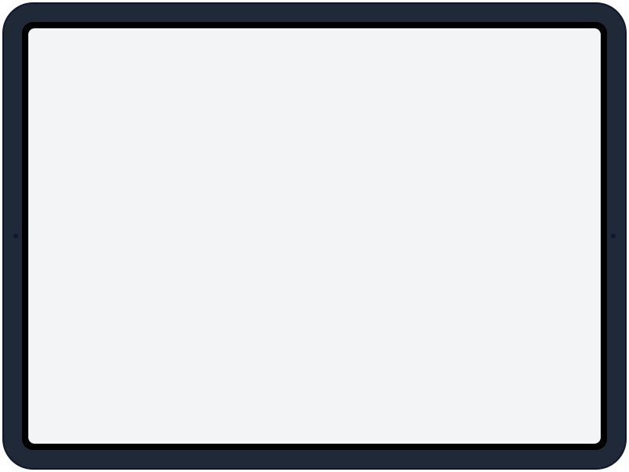

# Device frames canônicos

Frames pixel-accurate inspirados em [nexu-io/open-design](https://github.com/nexu-io/open-design) (Apache-2.0, commit `5e9687d`).

## Uso

```html
<div class="device">
  
  
</div>
```

```css
.device { position: relative; width: 800px; }
.frame  { width: 100%; display: block; }
.screen { position: absolute; inset: 4.5% 5%; width: 90%; height: 91%;
          object-fit: cover; border-radius: 12px; z-index: -1; }
```

## Arquivos

| Arquivo        | Aspect | Uso recomendado                          |
|----------------|--------|------------------------------------------|
| `ipad.svg`     | 4:3    | Mockups de software e documentos        |
| `iphone.svg`   | 9:19.5 | Reels preview, screenshots de IG/WhatsApp|
| `macbook.svg`  | 16:10  | Dashboards, websites                     |
| `monitor.svg`  | 16:9   | Hero shots de software, demos            |

Cores neutras (greys) pra não conflitar com identidade do cliente.
