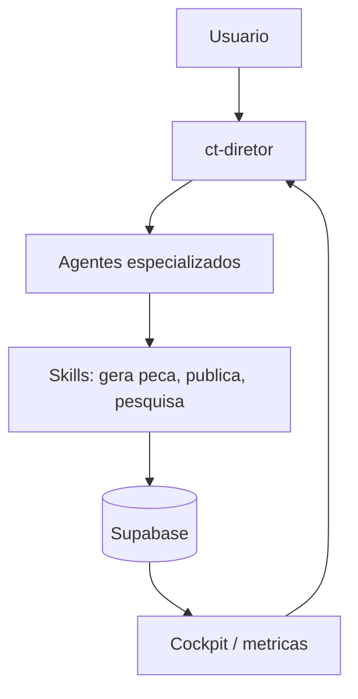

# Visao geral

Content Team AI e um framework white-label local: um conjunto de agentes de IA
especializados (25 hoje) que produzem conteudo para redes sociais (Instagram,
LinkedIn, YouTube, TikTok) para uma empresa por vez. Roda no computador de quem
opera, dentro do Claude Code ou do Codex, junto com um banco Supabase e um painel local.

## Pra quem e

Dono de empresa ou profissional de marketing que quer um "time de conteudo"
feito de agentes de IA, sem depender de uma agencia. Nao precisa saber
programar para usar; precisa de alguem tecnico para instalar.

## O que NAO e

Nao e um servico hospedado. Cada empresa roda a propria copia local da pasta,
com as proprias chaves. Instalacao: `docs/SETUP.md`.

## O que faz, em 1 tela

O usuario pede algo ("faz um carrossel sobre X"), o `ct-diretor` decide qual
agente cuida disso, o agente aciona a skill certa, o resultado e registrado no
banco e vira aprendizado para a proxima peca.
