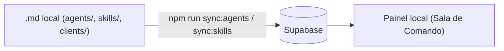

# Arquitetura em 3 camadas

O framework roda em 3 camadas:

- **Camada 1, arquivos locais**: `agents/*.md`, `skills/*/SKILL.md` e `clients/{slug}/`
  sao a fonte unica editavel. O Claude Code (ou Codex) le direto daqui.
- **Camada 2, Supabase**: banco com pecas, metricas, agenda e uma copia de agentes e
  skills enviada pelos scripts de sync.
- **Camada 3, painel**: a Sala de Comando (`npm run dev`) le do banco e dos arquivos.

<!-- WIKI:GERADO:START -->
### Numeros reais (gerado)

- Agentes em `agents/`: 25
- Pastas em `skills/`: 66
- Skills invocaveis (com `SKILL.md`): 65

<!-- WIKI:GERADO:END -->
