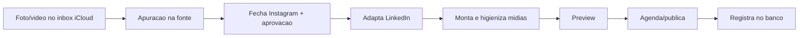

# Fluxos ponta a ponta

## a) "Publica isso" (ct-peca)

Skill dona: `ct-peca`. Nunca pula o portao de aprovacao antes de publicar.

## b) Video longo do YouTube vira 5 redes

Documentado em `docs/FLUXO-YOUTUBE-PARA-REDES.md`. Um video longo (podcast,
aula) e cortado e adaptado para Instagram, TikTok, LinkedIn, YouTube Shorts e
X, cada peca com legenda propria da rede.

## c) Talking-head vira Reel (ct-video-editor)

Video gravado com o rosto do cliente falando e editado automaticamente: corta
silencio, adiciona legenda sincronizada palavra a palavra e alterna com tela
de produto/proposta. Padrao canonico documentado em
`skills/ct-video-editor/SKILL.md`.

## d) Domingo: social-intel + cockpit

Uma rotina semanal (skill `ct-social-intel`) varre Instagram, YouTube, LinkedIn,
TikTok, concorrentes e tendencias e atualiza o cockpit de performance da marca
(resumo opcional pelo Telegram).
